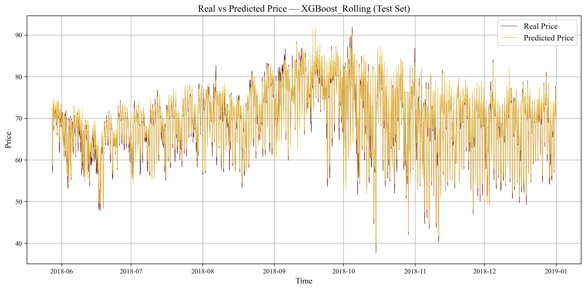

# **Electricity Price Forecasting & Systematic Trading Framework**

## **📌 Overview**

This repository provides a complete end-to-end framework for forecasting hourly intraday electricity prices on the Iberian market and converting these forecasts into systematic trading strategies. The project integrates data engineering, advanced machine-learning models, hyperparameter optimisation, and algorithmic trading mechanisms.  
Its objective is twofold:

1. **Forecast the next-hour electricity price** using state-of-the-art ML models.  
2. **Translate forecasts into actionable trading strategies**, with and without capital allocation.

The repository includes all preprocessing scripts, forecasting models, backtesting tools, evaluation metrics, and visualisations required to replicate and extend the study.

---

## **📊 Data**

The dataset merges:

- **Electricity market fundamentals:**  
  generation mix, total load, day-ahead prices, real intraday prices.  
- **Meteorological observations** (Madrid, Barcelona, Valencia, Bilbao, Seville).  
- **Engineered temporal features:**  
  lagged values, rolling windows, volatility indicators.

All variables are aligned at an **hourly frequency** and cleaned into two modelling datasets:
- **DATA1**: lag-only features  
- **DATA2**: lag + rolling statistics  

---

## **🤖 Forecasting Models**

The following models are implemented and compared:

### **XGBoost Models**
- Extensive feature engineering  
- Hyperparameter optimisation via Optuna (150–300 trials)  
- Best performance among all models  

### **LSTM Models**
- Sequence-to-one architecture (72h window)  
- Underperformed due to dataset size constraints  

### **LSTM + GRU + Attention**
- Hybrid recurrent architecture  
- Still outperformed by XGBoost on limited historical data  

### **Evaluation Metrics**
- RMSE, MAE, MAPE  
- R², MASE  
- Directional Accuracy  

Both **forecasting accuracy** and **ability to predict price movements** are assessed.

---

## **📈 Trading Strategies**

Six trading strategies are developed and backtested over the final 30 days (**720 hourly trades**):

### **Strategies Without Capital Allocation**
1. **Directional Trading**  
2. **Threshold Trading**  
3. **Mispricing Trading**  

### **Strategies With Capital Allocation**
4. **Proportional Signal Sizing**  
5. **Sigmoid Confidence Sizing** *(best performing)*  
6. **Kelly Criterion Sizing**

Each strategy produces:
- Hourly PnL  
- Cumulative PnL / capital curves  
- Winrate heatmaps  
- PnL distributions  
- Trade logs (CSV)

---

## **🏆 Key Results**

- **Best forecasting model:**  
  **XGBoost with lag + rolling features**

- **Best no-capital strategy:**  
  **Threshold Strategy**

- **Best capital-based strategy:**  
  **Sigmoid Confidence Sizing**

Profitability is confirmed with high Sharpe ratios, stable directional accuracy, and controlled drawdowns.

---

